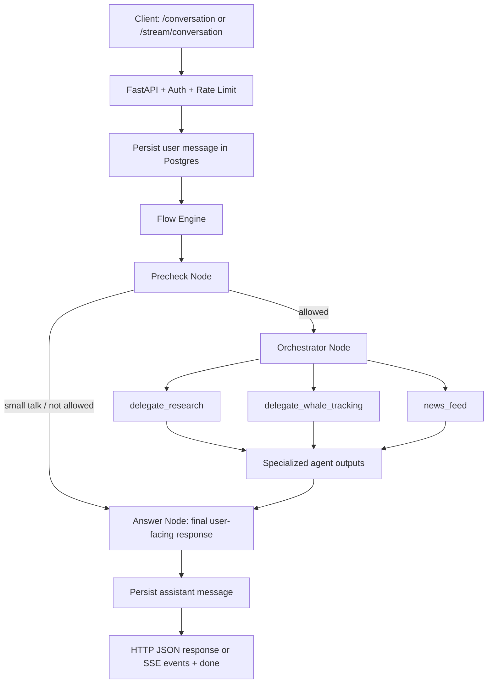

# FinAgent — AI Crypto & Macro Research Assistant

## 1) See it in action

> A fast, multi-agent assistant that turns one crypto question into a sourced answer with market, on-chain, and macro context.


> **Demo placeholder:** replace with a real product GIF (chat input → delegated analysis → final answer with sources).

---

## Why FinAgent

FinAgent is an API-first, production-oriented assistant for crypto and financial research.  
It combines specialized agents (market research, whale tracking, macro news) under one orchestrator, then returns a single user-friendly answer with references.

## End-to-end flow (E2E)



### Flow explanation (quick)
1. Request enters FastAPI (`/conversation` or `/stream/conversation`).
2. Message is saved and recent history is loaded.
3. **Precheck** classifies intent/language and can stop early for non-task content.
4. **Orchestrator** decides whether to answer directly or delegate to specialist tools.
5. Specialist outputs are merged into one grounded summary.
6. **Answer** formats the final response for the user.
7. Assistant message is stored; API returns JSON or streamed SSE events.

## What each tool gives you

### Orchestrator tools
- **`delegate_research`** → broad web/market research when fresh external evidence is needed.
- **`delegate_whale_tracking`** → on-chain whale behavior, exchange flows, wallet-level activity.
- **`news_feed`** → official Fed/SEC macro-regulatory updates.

### Research Agent tools
- **`base_crypto_tool`** → market snapshot (top coins, cap, volume, BTC dominance).
- **`exact_crypto_tool`** → detailed metrics for one selected coin.
- **`fear_greed_index_tool`** → market sentiment index (Fear & Greed).
- **`tavily_search`** → current web context and supporting sources.

### Whale Tracker tools
- **`coinmetrics_whale_flows`** → chain-level whale flow signals (inflow/outflow, z-score trends).
- **`wallet_activity`** → holdings and recent transactions for known wallet addresses.

### News Agent tools
- **`get_macro_news`** → filtered latest Fed + SEC headlines.
- **`extract_article`** → full-article extraction for relevant headlines.

## Architecture at a glance

- **Backend:** FastAPI + SSE
- **Agent framework:** `pydantic-ai`
- **Database:** PostgreSQL + SQLAlchemy (async)
- **HTTP resilience:** retry-enabled transport (`tenacity`)
- **Frontend:** lightweight static chat UI (`frontend/`)

## API surface

- `GET /health`
- `POST /conversation`
- `POST /conversation/{conversation_id}`
- `POST /stream/conversation`
- `POST /stream/conversation/{conversation_id}`
- `GET /history`
- `GET /conversations`

Auth: send `x-api-key` header.

## Quick start

### 1) Requirements
- Python 3.12+
- `uv`
- PostgreSQL (or Docker Compose)

### 2) Environment
Create `.env` in project root:

```env
API_KEY=your-local-api-key
OPENAI_API_KEY=your-openai-key
DB_HOST=localhost
DB_PORT=5432
DB_DATABASE=finagent
DB_USER=postgres
DB_PASSWORD=postgres
```

### 3) Install

```bash
uv sync --locked
```

### 4) Run with Docker Compose

```bash
docker compose up --build
```

### 5) Or run API locally

```bash
uv run uvicorn src.api.app:app --host 0.0.0.0 --port 9000
```

## Run tests

```bash
API_KEY=test-token OPENAI_API_KEY=sk-test-placeholder uv run pytest tests/ -v
```

---

## Recruiter-focused highlights

- Multi-agent orchestration with explicit delegation roles
- Structured outputs and source-aware responses
- Real-time streaming support (SSE)
- Conversation persistence + pagination
- Production-minded reliability (rate limiting, retries, health endpoint)
