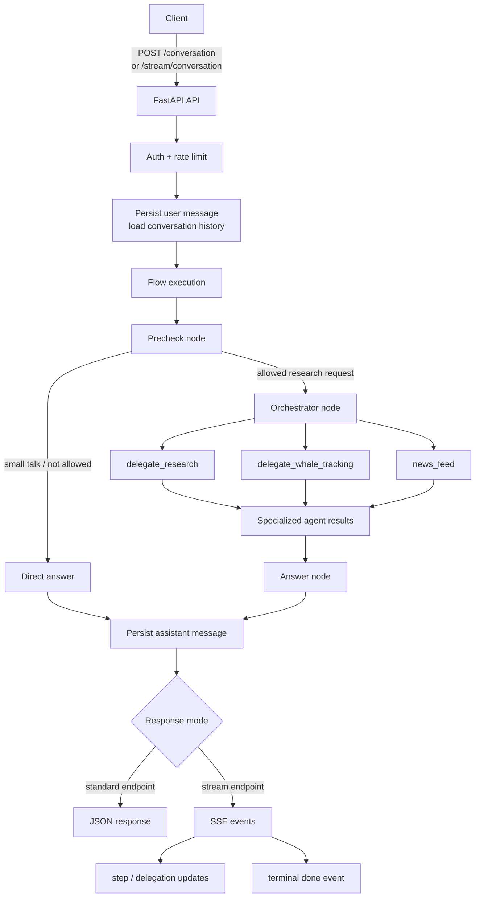

# FinAgent — AI Crypto & Macro Research Assistant

FinAgent is an API-first, multi-agent assistant for crypto and financial research. It turns a single user question into a sourced answer by combining market data, on-chain activity, macro news, and conversation context.

The core of the project is the backend flow: an asynchronous orchestration pipeline runs the required agents, persists the conversation, and can expose progress in real time through Server-Sent Events (SSE).

## Sample video

<video src="https://github.com/user-attachments/assets/8572f33e-36e4-4846-b11d-8b09a1999a64" controls muted width="100%"></video>

If the player does not load, [download or open the recording directly](https://github.com/user-attachments/assets/8572f33e-36e4-4846-b11d-8b09a1999a64).

## End-to-end flow



### What happens during a request

1. The API authenticates the request and applies the conversation rate limit.
2. The user message is stored in PostgreSQL and the recent conversation history is loaded.
3. The **precheck node** classifies the request, detects the language, and decides whether it is an allowed research task, small talk, or an unsupported request.
4. Allowed research requests are passed to the **orchestrator**, which decides which specialist agents are needed.
5. Specialist agents collect and structure the relevant evidence: market metrics, web research, whale/on-chain activity, or macro-regulatory news.
6. The **answer node** combines the results into one user-facing response with sources.
7. The assistant message and execution result are persisted. The caller receives either one JSON response or a live SSE stream.

## Async event queue and SSE

The flow is implemented as a producer/consumer pipeline so that the same execution can support both synchronous JSON responses and live progress updates.

### Async queue

**Why it exists:** a research request can take a while, and the client should see progress as it happens, not only the final answer. The queue lets the agents report what they are doing without knowing who is listening.

**How it works:** each request gets its own `asyncio.Queue` with two sides:

- **Producer**: a background task that runs the flow. Nodes and agents call `publish(event)` whenever something happens.
- **Consumer**: reads events from the queue as they arrive and passes them on. `/stream/conversation` sends them to the client as SSE; `/conversation` just waits for the final result.

**What is what:**

| Element | Role |
|---|---|
| `asyncio.Queue` | per request buffer between the running flow and the response |
| `publish()` | puts an event on the queue from anywhere in the flow |
| `ContextVar` | remembers which queue belongs to the current request, so parallel conversations never mix events |
| `step.started` / `step.finished` | a flow node (precheck, orchestrator, answer) began or ended |
| `delegation` | a specialist agent started, finished, or failed |
| `DONE` | marks the end of the stream, sent even if the flow fails |

```text
flow (producer) ──publish()──▶ asyncio.Queue ──▶ consumer ──▶ JSON or SSE
```

When the stream ends, the consumer builds the final result (answer, sources, timing, cost). If the client disconnects early, the running flow is cancelled.

### Server-Sent Events

The `/stream/conversation` endpoints expose the flow as `text/event-stream`. The API consumes the same async iterator used by the standard conversation endpoint and maps intermediate flow events to SSE messages.

Each queue event becomes one SSE message whose `event:` field is the event type:

- `step.started` / `step.finished`: a flow node starting or finishing;
- `delegation`: a research, whale-tracking, or news task changing status (`started`, `finished`, `failed`);
- `done`: the final answer with `conversation_id`, `status`, and `sources` (last message of the stream);
- `error`: sent instead of `done` when the turn failed; its data has the same shape and carries the fallback reply.

SSE is one-way: the client opens one HTTP connection, while the server writes events to it as the queue produces them. The stream also supports keep-alive comments, and the request can be cancelled if the client disconnects. Authentication and rate-limit failures are returned as regular JSON errors before the stream begins.

Use `/conversation` when the caller only needs the completed result. Use `/stream/conversation` when progress visibility matters or when the analysis may take long enough that waiting for a single response would provide poor feedback.

## Agents and tools

### Orchestrator tools

- **`delegate_research`** — broad web and market research when fresh external evidence is needed.
- **`delegate_whale_tracking`** — chain-wide whale behavior, exchange flows, and wallet activity.
- **`news_feed`** — filtered macro and regulatory news, including Federal Reserve and SEC updates.

### Research agent tools

- **`base_crypto_tool`** — market snapshot for major assets, including price, volume, market cap, and BTC dominance.
- **`exact_crypto_tool`** — detailed metrics for a selected asset.
- **`fear_greed_index_tool`** — market sentiment indicator.
- **`tavily_search`** — current web context and supporting sources.

### Whale tracker tools

- **`coinmetrics_whale_flows`** — exchange flows and chain-level activity compared with a historical baseline.
- **`wallet_activity`** — balances and recent transactions for known wallets, with bounded concurrent lookups.

### News agent tools

- **`get_macro_news`** — filtered Federal Reserve and SEC headlines.
- **`extract_article`** — article extraction for relevant headlines.

## Architecture at a glance

- **API:** FastAPI with standard JSON and SSE endpoints
- **Flow execution:** asynchronous node pipeline with per-request `asyncio.Queue`
- **Agent framework:** `pydantic-ai`
- **Database:** PostgreSQL with SQLAlchemy and `asyncpg`
- **Reliability:** rate limiting, retries via `tenacity`, health checks, and structured execution analytics
- **External data:** market APIs, CoinMetrics, Blockscout, mempool.space, RSS feeds, and web search

The frontend is intentionally not part of the main architecture description: it is only one possible client of the API. Any HTTP client that can send the API key and consume JSON or `text/event-stream` can use FinAgent.

## API surface

- `GET /health`
- `POST /conversation`
- `POST /conversation/{conversation_id}`
- `POST /stream/conversation`
- `POST /stream/conversation/{conversation_id}`
- `GET /history`
- `GET /conversations`

Send the API key in the `x-api-key` header. Streaming endpoints accept JSON request bodies and return `text/event-stream` responses.

## Quick start

### Requirements

- Python 3.12+
- `uv`
- PostgreSQL, or Docker Compose

### Environment

Create `.env` in the project root:

```env
API_KEY=your-local-api-key
OPENAI_API_KEY=your-openai-key
```

Optional database overrides are available through `HOST`, `PORT`, `DATABASE`, `USER`, and `PASSWORD`.

### Install

```bash
uv sync --locked
```

### Run with Docker Compose

```bash
docker compose up --build
```

### Or run the API locally

```bash
uv run uvicorn src.api.app:app --host 0.0.0.0 --port 9000
```

### Run tests

```bash
API_KEY=test-token OPENAI_API_KEY=sk-test-placeholder uv run pytest tests/ -v
```

## Project strengths

- Multi-agent orchestration with explicit delegation roles
- Asynchronous event pipeline that separates flow execution from response delivery
- Real-time SSE progress reporting for long-running research
- Structured outputs, source-aware answers, and execution analytics
- Conversation persistence with history and pagination
- Production-minded controls: authentication, rate limiting, retries, and health checks
